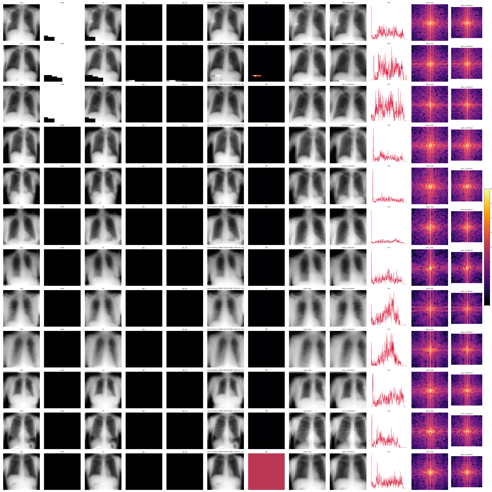
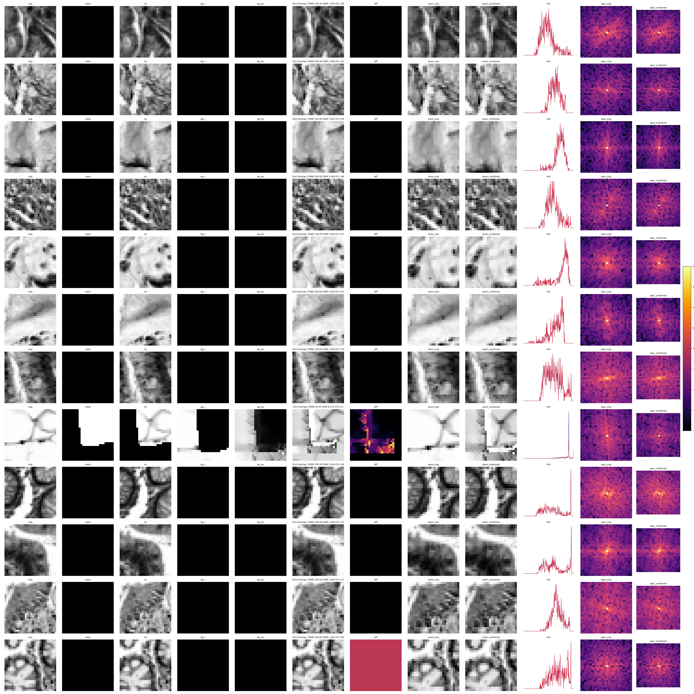
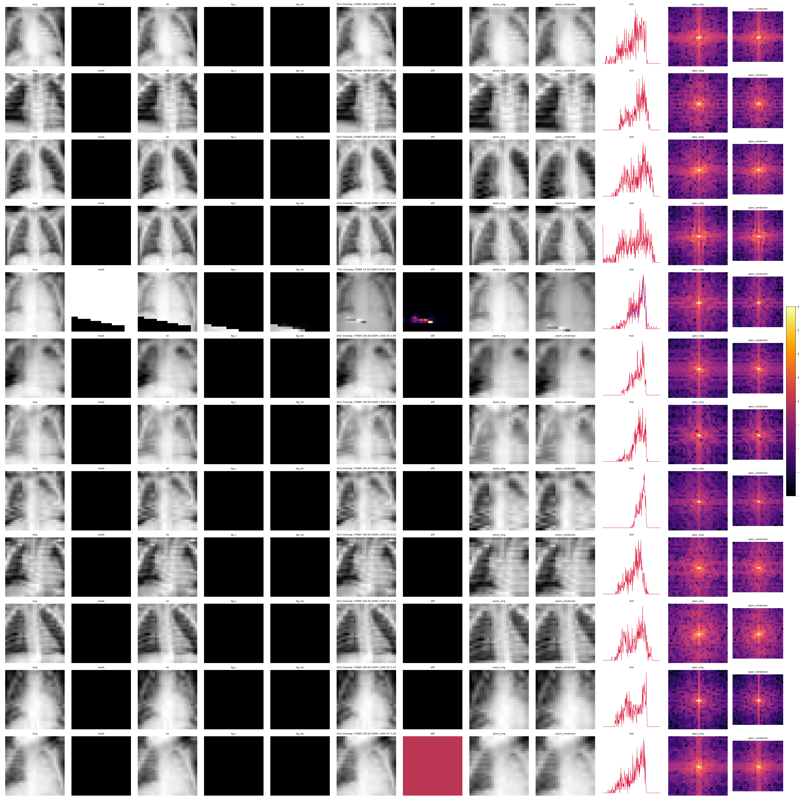

# 压缩后-解压可视化矩阵报告

参数: bs=8, measure_ratio=0.85, k_frac=0.2, stride=4, dict_patches=256, zoom=24

列含义: orig, mask, roi, bg_c, bg_rec, combined, diff, zoom_orig, zoom_combined, hist(蓝=orig,红=combined), spec_orig, spec_combined

## chestmnist

## pathmnist

## pneumoniamnist

